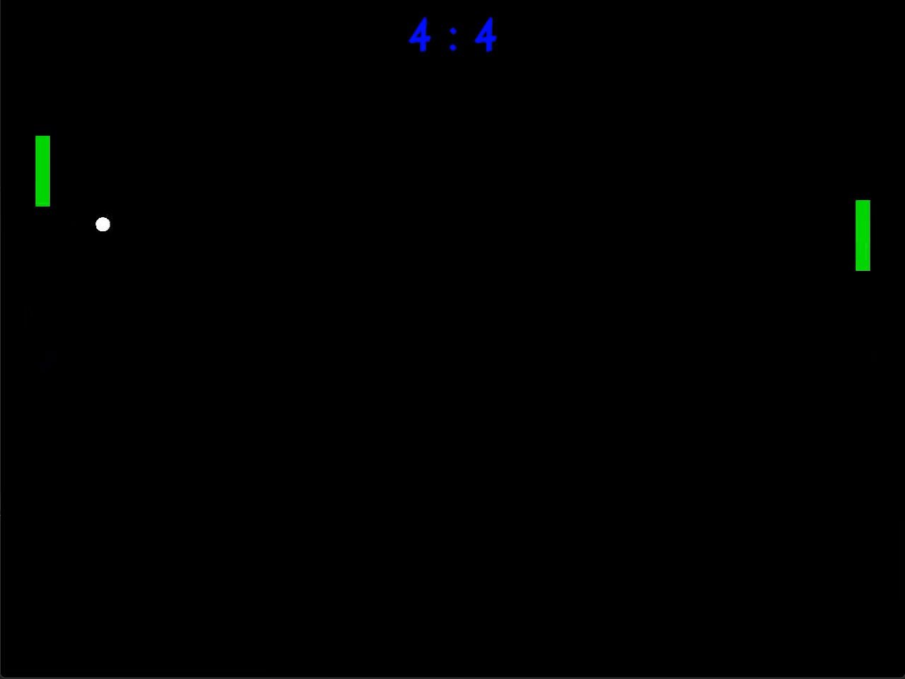
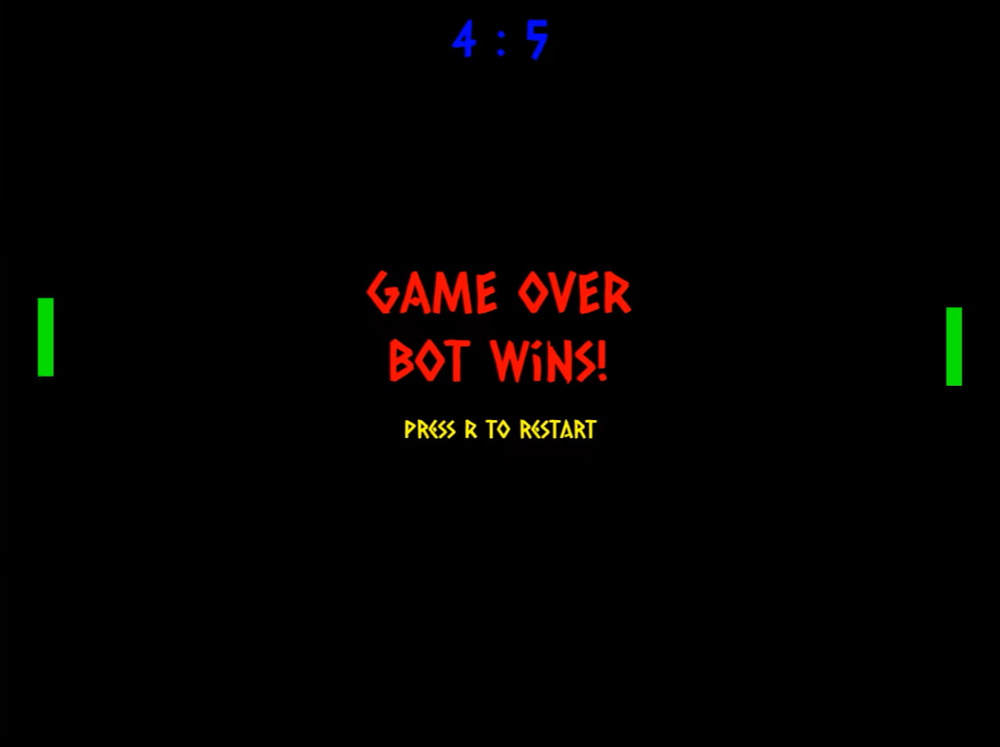

# 🎮 Pong Game

A classic **Pong** game with AI opponent, built from scratch in **C++17** using **SFML 3.0.2**.


---

## ✨ Features

- **Player vs AI** — Single-player mode with intelligent bot
- **Physics-based ball** — Angle-dependent paddle bounces
- **Score system** — First to 2 points wins
- **Game Over screen** — Winner announcement with restart option
- **Dynamic ball speed** — Increases with each paddle hit (max 800 px/s)
- **Post-goal pause** — 1-second delay with ball visible at center
- **Keyboard controls** — W/S to move, R to restart, ESC to quit

---

## 🎥 Demo





---

## 🛠 Tech Stack

- **C++17** — OOP, inheritance, polymorphism, STL, smart pointers
- **SFML 3.0.2** — Graphics, windowing, input handling
- **CMake 3.21+** — Cross-platform build system
- **Visual Studio 2022** — MSVC compiler (x64)

---

## 🏗 Architecture

```
GameObject (abstract base)
├── Paddle
├── Ball
└── TextObject
	├── ScoreText
	├── GameOverText
	└── RestartHintText
```

**Key patterns:**
- Inheritance & polymorphism via `GameObject`
- Composition (`Game` owns `Paddle`, `Ball`, UI objects)
- Game Loop (`handleEvents` → `update` → `render`)
- RAII with `std::unique_ptr`
- Constants in separate `Constants.h` (no magic numbers)
- Enum classes for type safety (`FieldCollision`, `LaunchDirection`)

---

## 🚀 Quick Start

### Requirements

- Windows 10/11 x64
- Visual Studio 2022 (with CMake tools)
- Git

### Build & Run

```
bash
# Clone with SFML submodule
git clone --recursive https://github.com/yourusername/PongGame.git
cd PongGame

# Generate Visual Studio solution
cmake -S . -B build -A x64

# Open in VS 2022
start build\PongGame.sln

# Build and run (F5)
```

---

## 🎮 Controls

| Key | Action |
|-----|--------|
| **W** | Move player paddle up |
| **S** | Move player paddle down |
| **R** | Restart after Game Over |
| **ESC** | Quit the game |

---

## 📚 What I Learned

- Designing a small **game architecture** with clear separation of responsibilities (input, update, render, UI, AI)
- Implementing an extensible **inheritance hierarchy** (`GameObject`, `Paddle`, `Ball`, `TextObject` and its descendants)
- Using **constants and strong types** (`constexpr` values, `enum class`) to avoid magic numbers and make code safer
- Managing UI and other heap-allocated resources with **RAII** and `std::unique_ptr`
- Integrating and building **SFML 3.0.2** via CMake and Git submodules on Windows


---

## 🎯 Future Improvements

- [ ] Main menu (Start / Settings / Quit)
- [ ] Local 2-player mode
- [ ] Sound effects (paddle hit, goal)
- [ ] Particle effects for ball trail
- [ ] Adjustable AI difficulty levels

---

## 📄 License

Created as a technical assignment for Junior C++ Developer position.
Free to use for learning purposes.

---

## 📧 Contact

**Author:** Daniella 

**LinkedIn:** daniellatskhovriebova

**Email:** daniellatskho@gmail.com

---

⭐ **Star this repo if you found it useful!**
